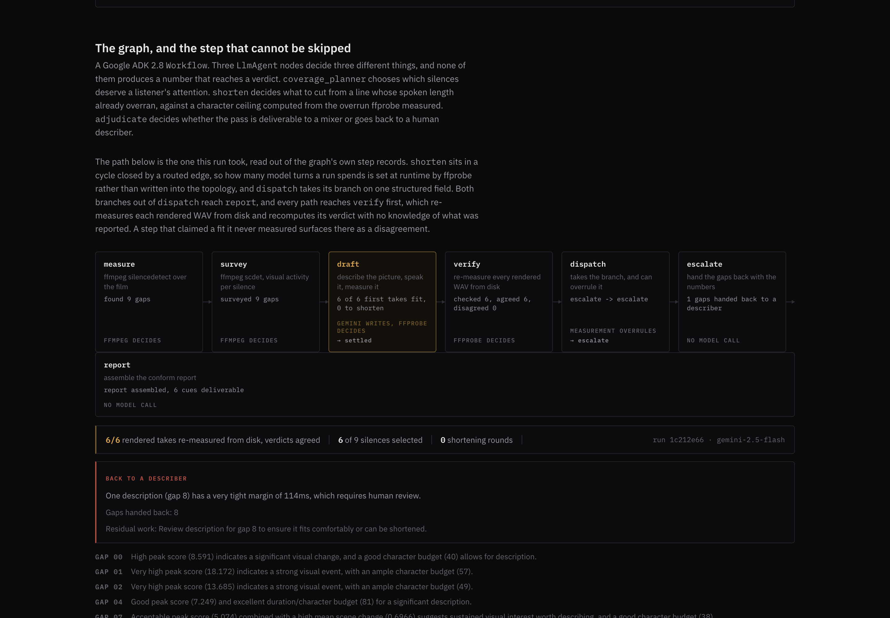
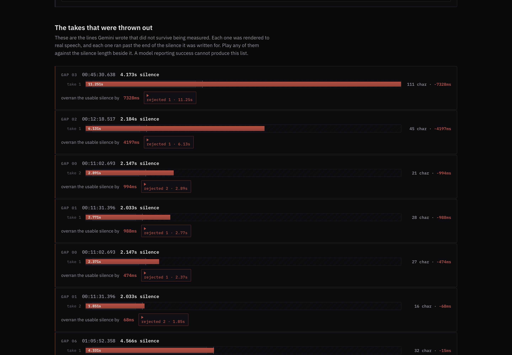
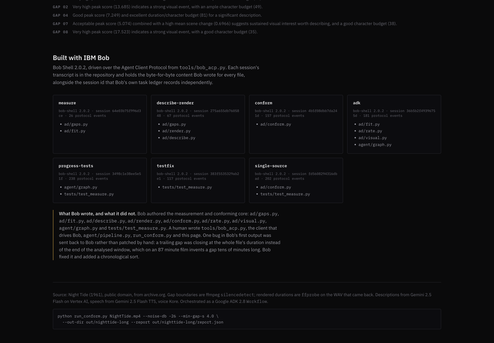

# Sightread

## Elevator pitch

> Audio description must fit the silence between two lines of dialogue. Sightread measures the silence, writes a line, speaks it, then re-measures the audio: 7 of 19 takes rejected.

179 characters.

## Inspiration

Audio description is mandated by the FCC in the United States and by Ofcom in the UK, and the way it gets made is three people in sequence. A describer watches the film and writes lines. A narrator records them. A re-recording mixer lays them into the silences and finds out that a line runs 400 milliseconds past the point where dialogue comes back, so it goes back up the chain to be rewritten and re-recorded.

That round trip is the whole cost, and it exists for one reason: nobody upstream knows the true length of the silence, and nobody knows the true length of the recorded line, until the last step.

Both of those are measurable before anyone speaks. `ffmpeg`'s `silencedetect` filter will tell you where every silence in a master is and how long it runs. `ffprobe` will tell you exactly how long a rendered WAV is. The measurement that is currently made last can be made first, and again at the end, and a line that does not fit can be thrown out before a mixer ever hears it.

The first version of the fitting logic got it wrong in a way worth recording. It assumed 14 characters per second, roughly subtitle reading speed, a number you can find in any style guide. The rendered audio disagreed. Measured across 19 real takes:

| | characters per second |
|---|---|
| minimum | 5.70 |
| median | 9.27 |
| mean | 8.88 |
| maximum | 11.39 |

14 sits outside the observed range entirely. That is why the first three silences overran by 474ms, 988ms and 4197ms. The default is now 8.6, and it is re-derived from the reports rather than typed in:

```
python -m ad.rate out/nighttide/report.json out/nighttide-long/report.json
```

Nothing but a second measurement makes a wrong constant like that visible, which is the argument for the whole design.

## What it does

Sightread takes a film, measures every silence in its audio, decides which of those silences are worth describing, writes one line for each, speaks it, measures the speech, and rejects the takes that overrun. The output is a conform report plus one WAV per silence at absolute timecode, which is what a mixer lays in.

The fourth step is the product. Everything else is a description generator and there are plenty of those.

**One run over Night Tide (1961)**, the full 87 minute public-domain master from archive.org, 5256.567s by `ffprobe`. Nine silences of 4 seconds or longer at a -26dB threshold. The agent selected six, all six fit, and all six verdicts were reproduced by an independent re-measurement from disk.

| silence | length | line | chars | spoken | margin | takes |
|---|---|---|---|---|---|---|
| 00:09:08.681 | 4.932s | A man kisses a woman. | 21 | 2.371s | +2311ms | 1 |
| 00:44:13.262 | 6.935s | A man stands in a room with shelves. Jars are on a shelf. | 57 | 5.531s | +1154ms | 1 |
| 00:44:43.530 | 6.034s | A man in a sailor suit looks down. | 34 | 3.331s | +2453ms | 1 |
| 00:59:57.802 | 9.693s | A man lies in bed, face tense, clenching his fist. A closed door appears. He's back in bed. | 91 | 8.291s | +1152ms | 1 |
| 01:13:57.808 | 4.684s | Man in bed, shirtless, with object. | 35 | 4.091s | +343ms | 1 |
| 01:25:17.804 | 4.375s | Dark clouds, bright light behind. | 33 | 4.011s | +114ms | 1 |

Reproduce it:

```
python agent/pipeline.py nighttide.mp4 --min-gap-s 4.0 --noise-db -26 \
  --out-dir out/adk-nighttide --report out/adk-nighttide/run.json
```

The three silences the planner left out, in its own words: gap 3 "Low peak indicates minimal significant visual change", gap 5 "Extremely low peak indicates very little visual change", gap 6 "Very low peak suggests minimal visual interest during this silence". Those are the long, visually static stretches. Narrating a still frame spends a listener's attention on nothing.

Every line fit. Nothing disagreed. The agent still refused to call the pass deliverable:

```
disposition     escalate
reason          One description (gap 8) has a very tight margin of 114ms,
                which requires human review.
hand_back       [8]
residual_work   Review description for gap 8 to ensure it fits comfortably
                or can be shortened.
```

114ms is a real number from a real WAV. Nothing in the code says a margin below some threshold is too tight, because nobody has measured what a mixer will tolerate. That was a judgement made at runtime, against figures the model could not alter. The CLI exited 3 rather than 0.



### The takes that did not survive

Twelve silences across two runs produced nineteen takes, of which seven were rejected on measurement:

| silence | length | wrote | spoken | overran by |
|---|---|---|---|---|
| 00:45:30.638 | 4.173s | 111 chars | 11.251s | 7328ms |
| 00:12:18.517 | 2.184s | 45 chars | 6.131s | 4197ms |
| 00:11:02.693 | 2.147s | 21 chars | 2.891s | 994ms |
| 00:11:31.396 | 2.033s | 28 chars | 2.771s | 988ms |
| 00:11:02.693 | 2.147s | 27 chars | 2.371s | 474ms |
| 00:11:31.396 | 2.033s | 16 chars | 1.851s | 68ms |
| 01:05:52.358 | 4.566s | 32 chars | 4.331s | 15ms |

Every one is a WAV on disk, and the hosted page plays them. The 15ms rejection matters as much as the 7328ms one: it is precisely the case a person mixing by ear lets through.



You can check the chain without cloning anything:

```
$ curl -sO https://sightread-387894104564.us-central1.run.app/audio/nighttide/gap0002.take1.wav
$ ffprobe -v error -show_entries format=duration -of default=nw=1:nk=1 gap0002.take1.wav
6.130958
```

6.130958s against a 2.184s silence. That is the number the report claims for that rejected take, measured on the file the service just handed you.

### What it refuses to guess

**The silence threshold.** Detection runs at a dBFS threshold the operator passes, and the report records the value that produced every figure in it. -26dB suits a 1961 optical soundtrack and a modern mix wants a lower one, so a silent default would put a number nobody chose underneath every margin on the page.

**Anything outside the silence.** A line is written from the video inside the gap and nothing else. The model is not shown the surrounding scene, so it never asserts a character's name or a continuity it cannot see.

**Whether a line that overran can be saved.** When the attempt cap is reached with the line still long, nothing quietly widens the gap or drops the cue. That silence goes to a human describer with the numbers attached, and no model verdict can publish past it.

**A verdict it did not measure.** The `verify` node re-reads every rendered WAV from disk and recomputes the verdict with no knowledge of what was reported. A mismatch lands in `verified.disagreed`, which is a defect in this tool rather than in the film, and it overrides any model verdict.

## How we built it

### The agent graph

A `google.adk.workflow.Workflow` in `agent/graph.py`, driven through ADK's `InMemoryRunner` in `agent/pipeline.py`. Seven function nodes, three `LlmAgent` nodes, three routed branches, and one of those branches closes a cycle.

```
START -> measure -> survey -> coverage_planner -> draft
draft      -> shorten     a take overran
           -> verify      every take fit
shorten    -> retake
retake     -> shorten     a take still overran and rounds remain
           -> verify      otherwise
verify     -> adjudicate -> dispatch
dispatch   -> escalate    the run needs a human describer
           -> report      it is deliverable as measured
escalate   -> report
```

| node | what it does | what decides |
|---|---|---|
| `measure` | `ffmpeg silencedetect` over the whole film | ffmpeg |
| `survey` | `ffmpeg scdet` per silence, peak and mean scene-change score | ffmpeg |
| `coverage_planner` | **Gemini.** Which silences earn a described line | model, from measured figures |
| `draft` | Cuts the gap's video, sends the clip to Gemini, speaks the line, measures the WAV | gemini writes, ffprobe decides |
| `shorten` | **Gemini.** What to cut from a line whose spoken length overran | model, against a measured ceiling |
| `retake` | Speaks the cut line, re-measures, routes on the result | ffprobe |
| `verify` | Re-measures every rendered WAV from disk, recomputes each verdict | ffprobe |
| `adjudicate` | **Gemini.** Deliverable to a mixer, or back to a describer | model, from the verify block |
| `dispatch` | Takes the branch on one structured field, and can overrule it | measurement overrules |
| `escalate` | Hands the gaps back with their numbers | no model call |
| `report` | Assembles the conform report | no model call |

The three model nodes decide three different things and none of them produces a number that reaches a verdict.

`coverage_planner` gets a JSON array of measured gaps, each with its length, its character budget at the measured speaking rate, and its `scdet` peak and mean. It returns indices and a reason per index, validated against a Pydantic `output_schema`. It cannot invent a gap: `draft` drops any index that was not in the measurement and records the discard.

`shorten` is the node that made this worth building. When a take overruns, it is handed the line, the measured overrun in milliseconds, and a character ceiling computed from that overrun at the observed rate `chars / rendered_duration_s`, plus five percent. Deciding whether to lose the adjective, the second sentence or the set dressing is judgement. The ceiling is arithmetic. From a run where a first take ran 377ms long:

```
take 1   38 char budget    33 chars   4.811s   -377ms   OVERFLOW
         "Man in bed, shirtless, with an object."
take 2   28 char ceiling   11 chars   1.811s  +2623ms   FIT
         "Man in bed."       dropped: Window, bedside lamp
```

The model recorded what it removed, for the mixer's record. Coming in under the ceiling did not make that line accepted: `retake` rendered it and `ffprobe` decided.

`adjudicate` reads the verify block and sets a disposition of `publish` or `escalate`. `dispatch` takes the branch on that one field, so the shape of a run is reproducible while the judgement inside it is not, and `dispatch` can overrule the model three ways: an unrecognised disposition routes to a person, a re-measurement disagreement overrides any verdict, and `publish` is unavailable while any row is OVERFLOW. `escalate` then hands back every non-FIT gap whether the adjudicator listed it or not. The model can widen that set and can never narrow it.

Because `retake` routes back into `shorten` on a routed edge rather than a straight one, the number of model turns in a run is set at runtime by `ffprobe`. A film whose silences all fit on the first take spends one turn per gap; one that does not spends as many as the cap allows. ADK permits a cycle exactly when it contains at least one routed edge, which is what makes that legal.

### Gemini and Google Cloud, at runtime

- `google-adk` 2.8.0. `google.adk.workflow.Workflow` with a Pydantic `state_schema`, `node()`, `RetryConfig`, and routing maps on the routed edges. Driven by `google.adk.runners.InMemoryRunner`, and the event trace the page shows is ADK's own record rather than a list assembled by hand beside it.
- `google-genai` 2.20.0 against Vertex AI. `gemini-2.5-flash` for all three `LlmAgent` nodes, each with a Pydantic `output_schema` and an `output_key` the next node reads.
- Gemini multimodal. `ad/describe.py` cuts the silence's video with ffmpeg and sends the clip inline as `types.Part.from_bytes(mime_type="video/mp4")`, so the line is written from the picture inside that silence.
- `gemini-2.5-flash-tts`, voice Kore, through `response_modalities=["AUDIO"]` and a `SpeechConfig`. `ad/render.py` reads the sample rate out of the response mime type and refuses to guess one when the API omits it, because a guessed rate makes every duration in the product wrong.
- Cloud Run, `us-central1`, built from the repository's Dockerfile.

Credentials are not optional and there is no stand-in for any of the three model nodes, because a stand-in producing the same shape of output would make the model decorative: you could delete it and the product would behave identically. `build_workflow` raises before constructing a single node when the process cannot reach a model, rather than discovering it inside the first `LlmAgent` after the whole silencedetect pass over an 87 minute film has been spent.

### Built with IBM Bob

Bob Shell 2.0.2, authenticated through browser SSO. `bob run` headless requires an API key, so this project never used it. `bob acp` starts Bob as an [Agent Client Protocol](https://agentclientprotocol.com) server over stdio and authenticates from the cached SSO session instead, and `tools/bob_acp.py` is a JSON-RPC client that drives it and writes a complete transcript for every session.

Seven sessions, all transcripts in `bob/transcripts/`, all task prompts in `bob/`. Bob's own SQLite ledger at `~/.bob/db/bob.db` recorded them independently: 22,158 output tokens across the six build sessions.

| file | what it does | session |
|---|---|---|
| `ad/gaps.py` | ffmpeg silencedetect, gap parsing, absolute timing | `64e03b75` |
| `ad/fit.py` | the fit verdict and the character budget | `64e03b75` |
| `ad/render.py` | Gemini TTS to a measurable WAV | `275a655d` |
| `ad/describe.py` | gap clip extraction and the Gemini description call | `275a655d` |
| `ad/conform.py` | the describe, render, re-measure, retry loop | `4b5f08db` |
| `ad/rate.py` | re-derives the speaking rate from report files | `36b5b2f4` |
| `ad/visual.py` | ffmpeg scdet scene activity per silence | `36b5b2f4` |
| `agent/graph.py` | the workflow graph and its nodes | `36b5b2f4` |
| `tests/test_measure.py` | the parser and fit tests | `3498c1e3` |

Each transcript is the raw ACP event stream. Every file Bob wrote appears as a `tool_call` event whose `rawInput.content` holds the complete byte-for-byte text, next to the session id, and Bob's `tasks` table carries the same session ids with their prompts and token counts. Two independent records, one of them IBM's own, and `/api/bob` reads the transcripts back off disk rather than restating them.



Two of those sessions exist because Bob's work went back to Bob rather than being patched by hand:

- `measure_gaps` closed an open trailing silence at the whole file's duration even when only a short window had been analysed, which on an 87 minute film invents a silence tens of minutes long. Bob fixed it and added a chronological sort.
- Bob's own test `test_parse_leading_silence_derives_start_from_duration` asserted `start_s != 0.0` against a fixture whose correct answer is exactly 0.0, so the assertion could not distinguish working code from broken code. Bob replaced the fixture with one where the two possible answers differ, and split the true zero case into its own test.

Bob also ships an `attribution_logs` table with per-file line ranges. It is empty here and this project does not claim those rows: that table is written by the Bob IDE, and the shell and ACP paths do not touch it.

## Challenges we ran into

**A check that could not fail, hiding in plain sight.** `silencedetect` and `scdet` write their findings to stderr at ffmpeg log level `info`. Pass `-v error` and every line vanishes while ffmpeg still exits zero. No exception, no non-zero return, no empty output file: just an empty stderr, and a parser reporting a film that contains no silence at all. The failure looks exactly like a correct measurement of a film with continuous dialogue. `tests/test_ffmpeg_loglevel.py` now builds a file with a 5 second digital silence in it and asserts the measurement finds it, and a source guard asserts neither of the two functions that read a filter's log sets a level. Adding `-v error` back to `measure_gaps` turns both red. `probe_duration` keeps `-v error` deliberately, because `ffprobe` writes the duration to stdout and the flag only quiets its banner.

**A green tally that covered nothing.** The suite reported 47 passed while not one test made a Gemini call. The three `LlmAgent` nodes and the two direct Gemini calls were entirely unexercised, and `pytest` counts a skip as a non-failure, so nothing in the output said so. Every gate now lives in `tests/conftest.py`, each one two stage, because `which ffmpeg` succeeding only proves a file exists on PATH and a credential being set only proves a string is set. So the version is run and the token is minted. A run that names a project and cannot reach it is a broken configuration and goes red rather than skipping. Four measured states:

| state | result | exit | time |
|---|---|---|---|
| bare clone, nothing configured | 48 passed, 5 skipped | 0 | 4.4s |
| `GOOGLE_CLOUD_PROJECT` set, credential broken | 48 passed, 5 errors | 1 | 5.7s |
| `SIGHTREAD_REQUIRE_FFMPEG=1`, ffmpeg absent | 4 errors | 1 | 0.1s |
| real Vertex endpoint | 53 passed, 0 skipped | 0 | 154.8s |

4.4 seconds to 154.8 seconds is the model path actually running. The end of every run names which integrations it exercised, so green is never ambiguous.

**The last node of the graph crashed after every model call had been paid for.** `report` rebuilt an `ad.conform.ConformedCue` from the cue dicts that `draft` writes into state. A field was added to the dataclass and not to the dict, so a full run over the film measured, described, spoke and verified everything, then raised `TypeError` on the final node. No test noticed, because no test drove that node. `tests/test_graph_contract.py` now reads the required fields off the dataclass and asserts the dict covers them, in milliseconds, and deleting the field turns it red.

**The graph state schema was decorative.** ADK resolves each node's parameters out of the session state and does not apply the `state_schema` defaults when filling it. A hand-written starting dict missing one key raises inside whichever node wanted it, which on this graph is after the whole silencedetect pass. That is how `survey` was found asking for `headroom_ms` from a state that did not have it. The starting state is now built by instantiating `ADState` and dumping it, so the schema's defaults are the run's defaults, and a test asserts every non-default parameter of every function node exists in it.

**A number that had already been wrong once, written down in four places.** The README claimed the speaking rate lived in exactly one place. It lived in three more: `ADState`, `run_pipeline`, and the graph. `tests/test_single_rate.py` walks the AST of every module under `ad/` and `agent/` and fails if the value appears as a literal outside `ad/fit.py`, and a second test patches the declaration and asserts every reader follows. Writing `8.6` back into `ADState` turns both red.

## Accomplishments that we're proud of

**The agent can lose an argument to a measurement, and did.** On the run above every line fit and nothing disagreed, and `adjudicate` still escalated on a 114ms margin. In the other direction, `dispatch` will not let a model publish a run holding a row `ffprobe` called OVERFLOW, and `escalate` adds every non-FIT gap the adjudicator left out. Both directions have a test, and both go red when the guard is removed.

**Every check was broken on purpose before it was believed.** Six mutations, each confirmed red and then restored to green:

| mutation | red |
|---|---|
| `require_model` becomes a no-op | 2 failed, 7 passed |
| `-v error` added to the silencedetect command | 2 failed, 2 passed |
| all three `dispatch` override branches removed | 6 failed, 11 passed |
| the non-FIT rows `escalate` adds emptied | 1 failed, 16 passed |
| `chars_per_second` deleted from the cue dict | 1 failed, 16 passed |
| the measured rate written back into `ADState` | 2 failed, 1 passed |

**The rejected takes ship as playable audio.** A margin figure is a claim until you can hear the line that produced it. Seven rejected takes are served from the hosted page, and the one that overran by 15ms is the interesting one.

**A wrong constant was caught by the product's own second measurement**, not by review, and the fix is checked by re-deriving it from the reports rather than by trusting a docstring.

## What we learned

A model reporting success cannot produce a list of its own rejected outputs. That list is the only part of this project that could not have been faked, and building the thing that generates it took less work than the description generator it wraps.

The most dangerous check is not one that fails. It is one that passes while measuring nothing, and both of the ones found here looked completely healthy: an ffmpeg command that exits zero with empty output, and a test tally that counts a skip as a non-failure. Neither would have been caught by reading the code. Both needed a case where the answer was known in advance and the check was made to produce the wrong one.

Giving a model a number it cannot change is what makes its judgement worth having. `adjudicate` reading a verify block it cannot edit produces a decision worth acting on. The same model asked whether the line fits would produce a sentence.

## What's next for Sightread

Placing the accepted lines into a mixed print, with ducking, so the output is a described master rather than a conform report plus WAVs. Scoring the coverage planner's selections against a professional describer's choices on a title where both exist. Running the same graph across a catalogue rather than a title, where the per-silence renders fan out and a broker stops being decoration.

## Built with

Python, Google ADK, google-genai, Gemini 2.5 Flash, Gemini 2.5 Flash TTS, Vertex AI, Google Cloud Run, FastAPI, Uvicorn, Pydantic, ffmpeg, ffprobe, IBM Bob, Agent Client Protocol, pytest

## Links

| | |
|---|---|
| Hosted | https://sightread-387894104564.us-central1.run.app |
| Graph run record | https://sightread-387894104564.us-central1.run.app/api/adk |
| Measured speaking rate | https://sightread-387894104564.us-central1.run.app/api/rate |
| Bob transcripts, read off disk | https://sightread-387894104564.us-central1.run.app/api/bob |
| A rejected take, as audio | https://sightread-387894104564.us-central1.run.app/audio/nighttide/gap0002.take1.wav |
| Source film | https://archive.org/download/NightTide16x9CorrectedAudio/NightTide_512kb.mp4 |
| Partner track | IBM |
